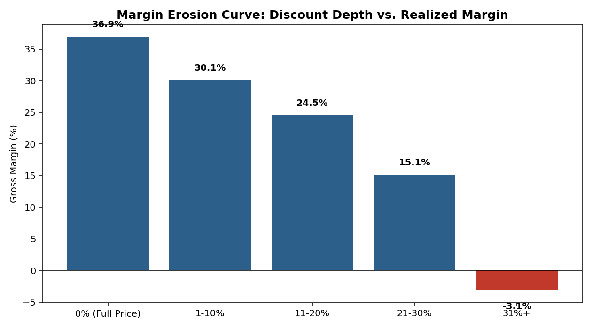

# Retail Profitability & Pricing Diagnostic

**Tools:** Python (pandas, NumPy, Matplotlib) · SQL (SQLite) · Excel (openpyxl) · Tableau

A diagnostic analysis of transaction-level retail data across product categories,
customer segments, and regions — built to identify **where margin is being lost**
and to size **specific pricing, discounting, and assortment actions** to recover it.

---

## Business Question

> Revenue is growing but gross margin has been drifting down. Where exactly is
> the erosion coming from — product mix, region, customer segment, or
> discounting behavior — and what should we do about it?

## Approach

1. **Ingest & model** transaction-level data (45,000 line items across 2 years,
   5 categories, 4 regions, 4 customer segments, 160 SKUs).
2. **Diagnose** the revenue/margin relationship at each cut: category, region,
   segment, and product — using SQL for exploratory aggregation and Python for
   deeper statistical/visual analysis.
3. **Quantify the discounting-margin relationship** — a margin erosion curve
   showing how gross margin decays as discount depth increases, including the
   point at which discounting becomes margin-*negative*.
4. **Size the opportunity** with a scenario/sensitivity model: what happens to
   revenue and profit if discount depth is capped on already-thin-margin
   categories.
5. **Package findings** into an executive Excel workbook and a Tableau-ready
   data extract.

## Key Findings

| Finding | Detail |
|---|---|
| **Margin erosion has a tipping point** | Gross margin falls from **36.9%** at full price to **-3.1%** once discounts exceed 31%. Volume lift no longer offsets the price concession past that depth. |
| **Two categories carry disproportionate margin risk** | Grocery (16.0% margin) and Electronics (19.6% margin) are the thinnest-margin categories by far, vs. 39–53% margin in Apparel, Home & Kitchen, and Health & Beauty. |
| **Value Shoppers over-index on deep discounting** | This segment discounts at nearly **2–5x** the rate of Premium customers (11.7% avg. vs. 2.3% avg.) while contributing below-average revenue per customer. |
| **A small set of SKUs drives disproportionate erosion** | The bottom 20 products by margin (all with >$1,000 in revenue) average just **9.7% margin**, representing ~$460K of revenue exposed to continued price erosion. |
| **Capping discounts is a low-risk, margin-accretive move** | Capping Grocery & Electronics discounts at 20% costs almost nothing in revenue (**+0.2%**, due to modeled volume pull-back) while lifting gross profit by **+1.7% (~$24K annualized on this sample)**. |



## Recommendations

1. **Cap discount depth at 20–25%** on Grocery and Electronics, the two
   categories where margin is already thin — deeper discounts there are
   value-destructive on a fully loaded basis.
2. **Reprice or delist the bottom-20 margin SKUs**, starting with the ones
   carrying material revenue (`data/bottom20_margin_products.csv`).
3. **Shift promotional spend away from blanket discounting toward
   segment-targeted offers** — Premium customers convert at full price; deep
   discounts are largely subsidizing Value Shoppers who would likely still
   purchase at a shallower discount.
4. **Monitor the region x category matrix quarterly** (see workbook) — Midwest
   Electronics and West Grocery are the two lowest-margin cells and warrant a
   focused pricing review.

## Repository Structure

```
retail-profitability-pricing-diagnostic/
├── data/
│   ├── transactions.csv              # 45K line-item transactions (raw fact table)
│   ├── products.csv                  # Product catalog (160 SKUs)
│   ├── stores.csv                    # Store list with region/size
│   ├── customers.csv                 # Customer list with segment/region
│   ├── tableau_extract.csv           # Denormalized, Tableau-ready extract
│   ├── bottom20_margin_products.csv  # Repricing/delist candidate list
│   ├── scenario_summary.csv          # Scenario analysis output
│   └── summary_*.csv                 # Pre-aggregated summary tables
├── sql/
│   └── analysis_queries.sql          # 7 exploratory/diagnostic SQL queries
├── scripts/
│   ├── 01_generate_data.py           # Synthetic data generator (reproducible)
│   ├── 02_run_sql.py                 # Validates all SQL against SQLite
│   ├── 03_analysis.py                # Core Python diagnostic + charts
│   ├── 04_build_excel.py             # Builds the executive Excel workbook
│   └── 05_export_tableau.py          # Builds the Tableau data extract
├── excel/
│   └── pricing_diagnostic_summary.xlsx  # Exec workbook (formula-driven, 6 tabs)
├── visuals/
│   └── *.png                         # Charts referenced in this README
├── requirements.txt
└── README.md
```

## How to Reproduce

```bash
pip install -r requirements.txt

# 1. Generate the synthetic transaction dataset
python scripts/01_generate_data.py

# 2. Validate the SQL diagnostic queries
python scripts/02_run_sql.py

# 3. Run the core Python analysis (writes charts + summary tables)
python scripts/03_analysis.py

# 4. Build the executive Excel workbook
python scripts/04_build_excel.py

# 5. Build the Tableau-ready extract
python scripts/05_export_tableau.py
```

## Excel Workbook

`excel/pricing_diagnostic_summary.xlsx` contains 6 tabs:

- **Raw Data** — transaction-level sample (5,000 rows) as the source range
- **Category Summary** — `SUMIFS`/`AVERAGEIFS` formulas over Raw Data, with a chart
- **Discount Erosion** — the margin erosion curve in table form
- **Customer Segment** — profitability and discount reliance by segment
- **Bottom Margin Products** — repricing/delist candidate list
- **Scenario Analysis** — baseline vs. capped-discount scenario comparison

All summary formulas reference the Raw Data tab directly, so the workbook
recalculates automatically if that tab is refreshed with a new data pull.

## Tableau

Import `data/tableau_extract.csv` as a data source. Suggested dashboard:

- Sheet 1: Revenue & Margin by Category (bar + line combo)
- Sheet 2: Margin Erosion Curve (discount band vs. margin)
- Sheet 3: Region x Category heatmap
- Sheet 4: Segment discount-reliance scatter (bubble = revenue)
- Filters: `order_month`, `region`, `customer_segment`, `category`

## Notes on the Data

The dataset in this repository is **synthetically generated** (see
`scripts/01_generate_data.py`) to mirror the structure and statistical
properties of real retail transaction data — including realistic elasticity
effects (deeper discounts lift volume but erode margin) and segment-level
discount-seeking behavior. The methodology, SQL, and analysis code are
directly reusable against a real POS/ERP extract with the same schema.
